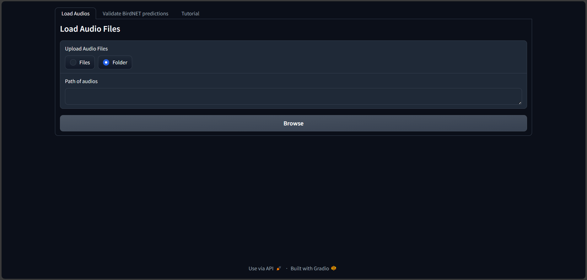
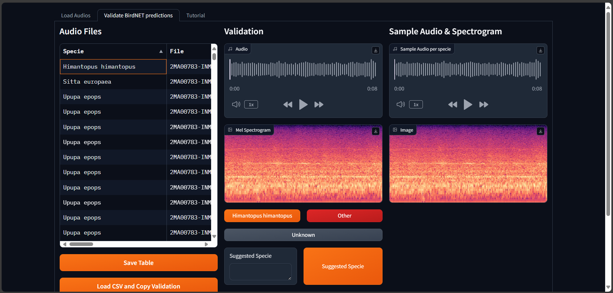
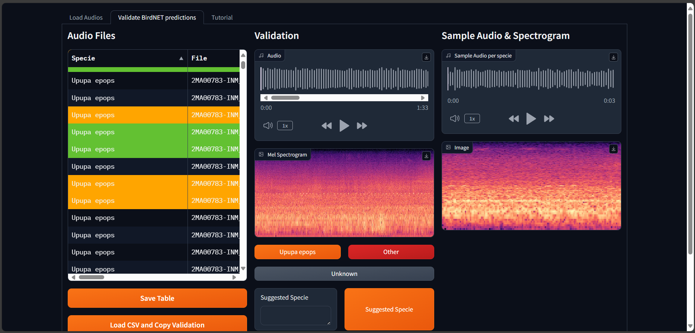

# BirdNET Predictions Validator App

BirdNET Predictions Validator App is a Gradio-based Python application designed to facilitate the validation of bird species predictions generated by BirdNET. The app allows users to visualize, listen to audio segments, and record the accuracy of predictions in a downloadable CSV file. This tool aims to be a public resource for ornithologists, bird enthusiasts, and developers to validate and improve bird species prediction models.

## Features

- **Audio Segments Visualization**: Visual representation of audio segments for easy navigation.
- **Audio Playback**: Listen to audio files directly within the app.
- **Prediction Validation**: Mark predictions as accurate or inaccurate.
- **CSV Export**: Export validation results to a CSV file for further analysis.
- **User-Friendly Interface**: Intuitive and easy-to-use interface powered by Gradio.
- **Multi-Species Support**: Handle multiple species folders simultaneously.
- **Real-Time Feedback**: Immediate validation feedback for each audio segment.

## Getting Started

### Prerequisites

- Python 3.7 or higher
- Gradio
- Pandas
- Librosa (for audio processing)

### Installation

1. Clone the repository:

```bash
git clone https://github.com/GrunCrow/BirdNET-PredictionsValidator-App.git
cd BirdNET-PredictionsValidator-App
```

2. Install the required packages:

```bash
pip install -r requirements.txt
```

### Usage

1. Prepare your audio files in the following format:

```python
root_folder/
├── Specie1/
│ ├── audio1.wav
│ └── audio2.WAV
├── Specie2/
│ ├── audio1.wav
│ └── audio2.WAV
...
```

2. Run the application:

```bash
python app.py
```

3. Open the provided link in your web browser to access the app.


### How to Use

1. **Select Audios Folder**: Choose the folder containing the audio files.



2. **Visualize and Play Audio**: View and listen to the audio segments.



3. **Validate Predictions**: Mark the prediction as correct or incorrect.



4. **Download CSV**: Export the validation results as a CSV file for further analysis.

## Contributing

Contributions are welcome! If you have suggestions for improvements or find bugs, please create an issue or submit a pull request. Your contributions can help make this app better for everyone.

## License

This project is licensed under the MIT License. See the [LICENSE](LICENSE) file for details.

## Contact

If you have any questions or need further assistance, please feel free to contact me in the Issues of the repository.

## Acknowledgments

- BirdNET for the bird species prediction model.
- Gradio for the user-friendly interface framework.
- Librosa and Pandas for audio processing and data manipulation.
